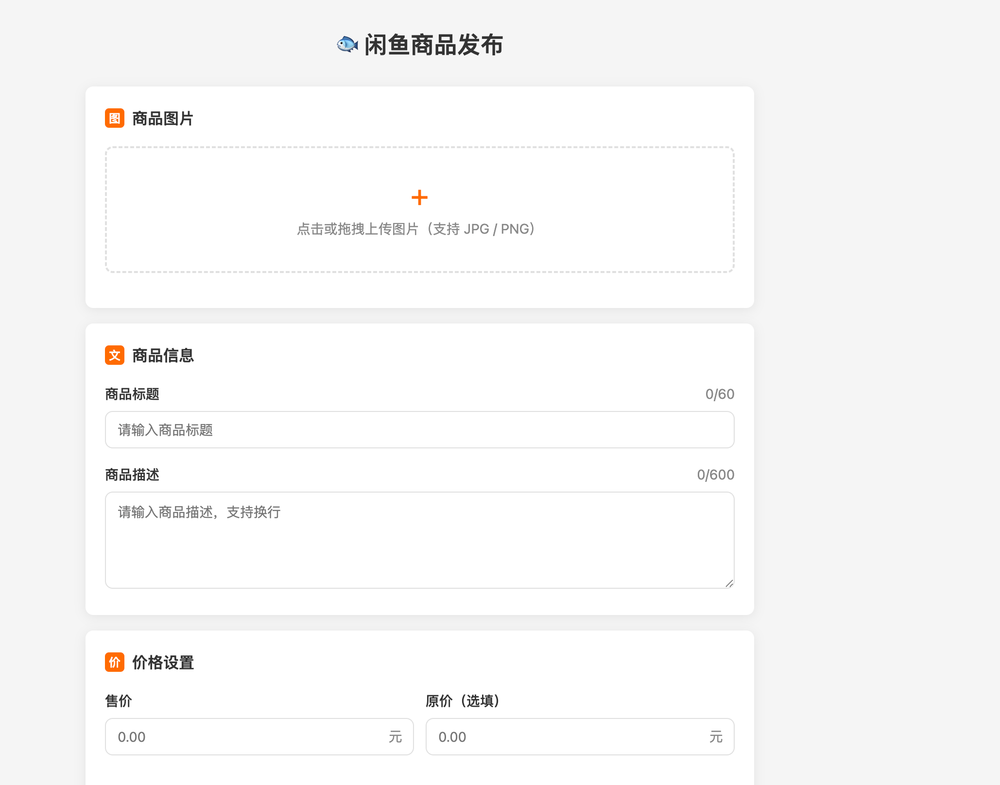

# xianyu

这是一个咸鱼闲置发表的脚本，预计后续实现ai自动生成文案、图片等功能。实现自动发表

## 加密

这里加密已经破案了，就是没有加盐的md5

密参就是 k = i(d.token + "&" + j + "&" + h + "&" + c.data)

1. 这里d.token是跟随cookies里的_m_h5_tk "_" 前面的值。
2. j就是时间戳13位，毫秒级
3. h大概也是写死的"34839810"
4. c.data 就是调接口的时候的data
   
以上4个参数都用&合并起来，再过一下md5就行了

## 目前实现：
商品发布，但是需要手动更改一下cookies。

## 后续将实现

### 1. 自动登陆，或者内部嵌套网页跳转，用来解决用户的登陆问题
### 2. 批量发表， 将当前的页面复制成多个。

