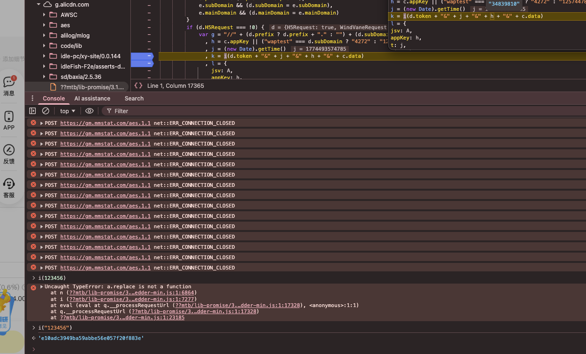

# XianYu
这是一个咸鱼闲置发表的脚本

## 加密

这里加密已经破案了，就是没有加盐的md5

密参就是 k = i(d.token + "&" + j + "&" + h + "&" + c.data)

1. 这里d.token大概是写死的："05e42922c61601673049ce5b3a1a30c5"
2. j就是时间戳13位，毫秒级
3. h大概也是写死的"34839810"
4. c.data 就是调接口的时候的data
   
以上4个参数都用&合并起来，再过一下md5就行了
